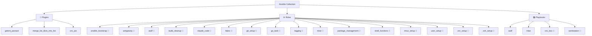

# Ansible Collection: CowDogMoo Workstation

[](https://github.com/CowDogMoo/ansible-collection-workstation/blob/main/LICENSE)
[](https://github.com/CowDogMoo/ansible-collection-workstation/actions/workflows/pre-commit.yaml)
[](https://github.com/CowDogMoo/ansible-collection-workstation/actions/workflows/molecule.yaml)
[](https://github.com/CowDogMoo/ansible-collection-workstation/actions/workflows/renovate.yaml)

This Ansible collection provides a comprehensive setup for my
workstation environment, covering various aspects, including user setup,
package management, ZSH configuration, VNC setup, ASDF version manager,
AI development tools (Fabric, Claude Code), and logging for different applications.

## Architecture Diagram


```mermaid
graph TD
    Collection[Ansible Collection]
    Collection --> Plugins[🔌 Plugins]
    Plugins --> P0[getent_passwd]
    Plugins --> P1[merge_list_dicts_into_list]
    Plugins --> P2[vnc_pw]
    Collection --> Roles[⚙️ Roles]
    Roles --> R0[ansible_bootstrap 🧪]
    Roles --> R1[antigravity 🧪]
    Roles --> R2[asdf 🧪]
    Roles --> R3[build_cleanup 🧪]
    Roles --> R4[claude_code 🧪]
    Roles --> R5[fabric 🧪]
    Roles --> R6[git_setup 🧪]
    Roles --> R7[go_task 🧪]
    Roles --> R8[logging 🧪]
    Roles --> R9[mise 🧪]
    Roles --> R10[package_management 🧪]
    Roles --> R11[shell_functions 🧪]
    Roles --> R12[tmux_setup 🧪]
    Roles --> R13[user_setup 🧪]
    Roles --> R14[vnc_setup 🧪]
    Roles --> R15[zsh_setup 🧪]
    Collection --> Playbooks[📚 Playbooks]
    Playbooks --> PB0[asdf]
    Playbooks --> PB1[mise]
    Playbooks --> PB2[vnc_box 🧪]
    Playbooks --> PB3[workstation 🧪]
```

## Requirements

- Ansible 2.15 or higher

## Installation

Install latest version of the Workstation collection:

```bash
ansible-galaxy collection install git+https://github.com/CowDogMoo/ansible-collection-workstation.git,main
```

Alternatively, you can build the collection locally and install it from
the generated tarball:

```bash
ansible-galaxy collection build --force && \
  ansible-galaxy collection install cowdogmoo-workstation-*.tar.gz -p ~/.ansible/collections --force --pre
```

## Roles

Each role has its own README under `roles/<name>/README.md` with full variable
docs and examples. The table below is regenerated from each role's
`meta/main.yml` by `.hooks/gen-arch-diagram.py` on pre-commit — don't edit it
by hand.

<!-- ROLES TABLE START -->

| Role | Description |
| ---- | ----------- |
| [`ansible_bootstrap`](roles/ansible_bootstrap/README.md) | Templates ~/.ansible.cfg and creates the ~/.ansible directory tree (collections, roles, fact_cache) plus the remote tmp directory. |
| [`antigravity`](roles/antigravity/README.md) | Manages Antigravity CLI configuration including hooks and settings |
| [`asdf`](roles/asdf/README.md) | Installs the asdf version manager, wires it into the user's shell, and installs configured plugins. |
| [`build_cleanup`](roles/build_cleanup/README.md) | General-purpose, parameterized cleanup role for build artifact minimization |
| [`claude_code`](roles/claude_code/README.md) | Manages Claude Code CLI configuration including hooks and settings |
| [`fabric`](roles/fabric/README.md) | Installs and configures Daniel Miessler's Fabric AI framework |
| [`git_setup`](roles/git_setup/README.md) | Renders ~/.gitconfig with aliases and sane defaults |
| [`go_task`](roles/go_task/README.md) | Installs go-task (Task runner) on Unix-like and Windows systems |
| [`logging`](roles/logging/README.md) | Provides flexible logging directories and log rotation for any application or service. |
| [`mise`](roles/mise/README.md) | Installs the mise polyglot tool version manager, wires it into the user's shell, and installs configured default tools. |
| [`package_management`](roles/package_management/README.md) | Manage package installations and cleanups on Debian-based and Red Hat-based systems |
| [`shell_functions`](roles/shell_functions/README.md) | Deploys the user's dotfiles shell-function library to ~/.dotfiles |
| [`tmux_setup`](roles/tmux_setup/README.md) | Renders ~/.tmux.conf with mouse-friendly bindings and OSC52 clipboard |
| [`user_setup`](roles/user_setup/README.md) | Sets up user accounts with optional sudo privileges for Unix-like and Windows systems. |
| [`vnc_setup`](roles/vnc_setup/README.md) | Installs and configures TigerVNC servers with per-user passwords and optional systemd units. |
| [`zsh_setup`](roles/zsh_setup/README.md) | Installs and configures zsh with oh-my-zsh. |

<!-- ROLES TABLE END -->

## Usage

Include the roles from this collection in your playbook. Here's an example:

```yaml
---
- name: Provision system
  hosts: localhost
  roles:
    - cowdogmoo.workstation.asdf
    - cowdogmoo.workstation.user_setup
    - cowdogmoo.workstation.package_management
    - cowdogmoo.workstation.fabric
    - cowdogmoo.workstation.claude_code
    ...
```

## Development

### Setting Up Development Environment

To set up the development environment and install all required dependencies,
including docsible for automatic documentation generation:

```bash
python3 -m pip install -r .hooks/requirements.txt
```

### Documentation Generation

This project uses [docsible](https://github.com/docsible/docsible) to automatically
generate documentation for Ansible roles. Documentation is generated automatically
via pre-commit hooks when changes are made to role files.

## License

This collection is licensed under the MIT License - see the [LICENSE](LICENSE)
file for details.

## Support

- Repository: [cowdogmoo/ansible-collection-workstation](http://github.com/CowDogMoo/ansible-collection-workstation)
- Issue Tracker: [GitHub Issues](https://github.com/CowDogMoo/ansible-collection-workstation/issues)

## Authors

- Jayson Grace ([techvomit.net](https://techvomit.net))
