# Ansible Collection: CowDogMoo Workstation

[](https://github.com/CowDogMoo/ansible-collection-workstation/blob/main/LICENSE)
[](https://github.com/CowDogMoo/ansible-collection-workstation/actions/workflows/pre-commit.yaml)
[](https://github.com/CowDogMoo/ansible-collection-workstation/actions/workflows/molecule.yaml)
[](https://github.com/CowDogMoo/ansible-collection-workstation/actions/workflows/renovate.yaml)

This Ansible collection provides a comprehensive setup for my
workstation environment, covering various aspects, including user setup,
package management, ZSH configuration, VNC setup, ASDF version manager,
AI development tools (Fabric, Claude Code), and logging for different applications.

## Architecture Diagram

```mermaid
graph TD
    Collection[Ansible Collection]
    Collection --> Plugins[🔌 Plugins]
    Plugins --> P0[vnc_pw]
    Plugins --> P1[merge_list_dicts_into_list]
    Plugins --> P2[getent_passwd]
    Collection --> Roles[⚙️ Roles]
    Roles --> R0[go_task 🧪]
    Roles --> R1[asdf 🧪]
    Roles --> R2[user_setup 🧪]
    Roles --> R3[claude_code 🧪]
    Roles --> R4[vnc_setup 🧪]
    Roles --> R5[package_management 🧪]
    Roles --> R6[build_cleanup 🧪]
    Roles --> R7[fabric 🧪]
    Roles --> R8[zsh_setup 🧪]
    Roles --> R9[logging 🧪]
    Collection --> Playbooks[📚 Playbooks]
    Playbooks --> PB0[workstation 🧪]
    Playbooks --> PB1[asdf]
    Playbooks --> PB2[vnc_box 🧪]
```



## Requirements

- Ansible 2.15 or higher

## Installation

Install latest version of the Workstation collection:

```bash
ansible-galaxy collection install git+https://github.com/CowDogMoo/ansible-collection-workstation.git,main
```

Alternatively, you can build the collection locally and install it from
the generated tarball:

```bash
ansible-galaxy collection build --force && \
  ansible-galaxy collection install cowdogmoo-workstation-*.tar.gz -p ~/.ansible/collections --force --pre
```

## Roles

### ASDF

Installs and configures [ASDF](https://asdf-vm.com/), a version manager for
multiple language runtimes.

### User Setup

Sets up user accounts with optional sudo privileges on Unix-like systems.

### Package Management

Manages package installations and cleanups on Debian-based and Red Hat-based systems.

### Zsh Setup

Installs and configures Zsh with Oh-My-Zsh, setting up a robust shell environment.

### VNC Setup

Configures VNC services for remote desktop access, including password
management and service setup.

### Logging

Creates logging directories and log rotation configurations for a provided path.

### Fabric

Installs and configures [Fabric](https://github.com/danielmiessler/fabric),
an open-source AI framework for augmenting humans using AI.

### Claude Code

Installs and manages [Claude Code](https://docs.claude.com/en/docs/claude-code)
CLI, including installation, configuration, hooks, and settings.

### Go Task

Installs and configures [go-task](https://taskfile.dev/), a task runner and
build tool written in Go, providing a simpler alternative to Make.

### Build Cleanup

A general-purpose, parameterized cleanup role for build artifact minimization.
Optimizes container images and build environments by removing unnecessary files,
caches, and temporary artifacts.

## Usage

Include the roles from this collection in your playbook. Here's an example:

```yaml
---
- name: Provision system
  hosts: localhost
  roles:
    - cowdogmoo.workstation.asdf
    - cowdogmoo.workstation.user_setup
    - cowdogmoo.workstation.package_management
    - cowdogmoo.workstation.fabric
    - cowdogmoo.workstation.claude_code
    ...
```

## Development

### Setting Up Development Environment

To set up the development environment and install all required dependencies,
including docsible for automatic documentation generation:

```bash
python3 -m pip install -r .hooks/requirements.txt
```

### Documentation Generation

This project uses [docsible](https://github.com/docsible/docsible) to automatically
generate documentation for Ansible roles. Documentation is generated automatically
via pre-commit hooks when changes are made to role files.

## License

This collection is licensed under the MIT License - see the [LICENSE](LICENSE)
file for details.

## Support

- Repository: [cowdogmoo/ansible-collection-workstation](http://github.com/CowDogMoo/ansible-collection-workstation)
- Issue Tracker: [GitHub Issues](https://github.com/CowDogMoo/ansible-collection-workstation/issues)

## Authors

- Jayson Grace ([techvomit.net](https://techvomit.net))
